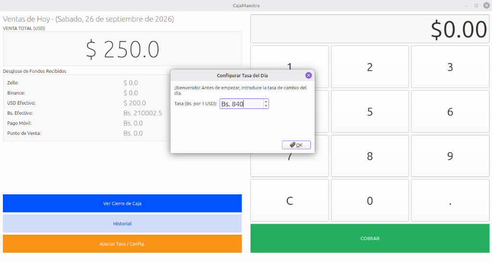
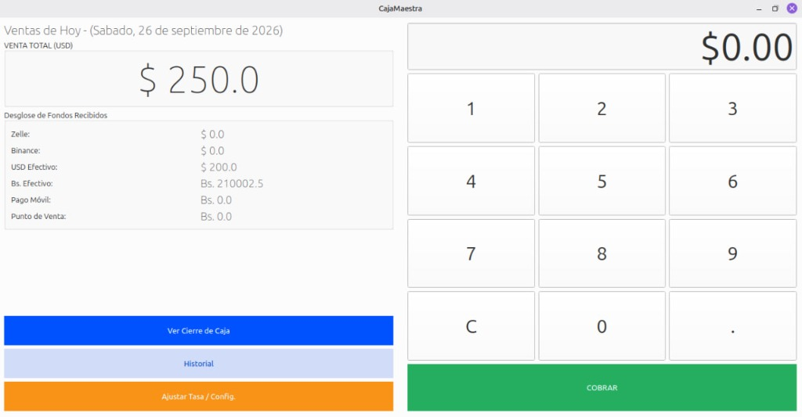
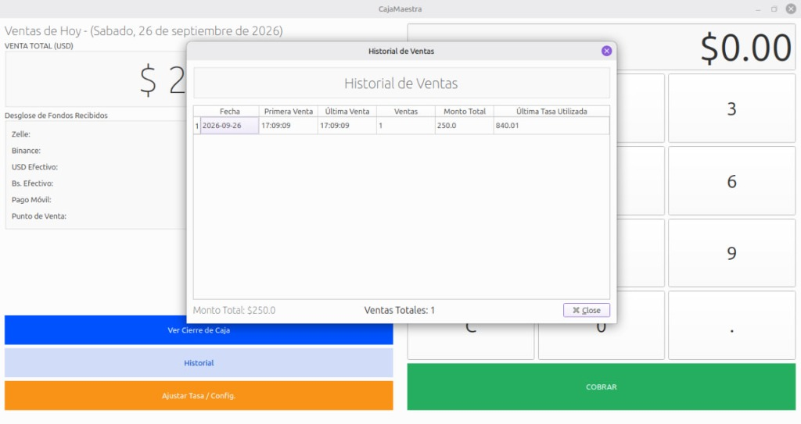
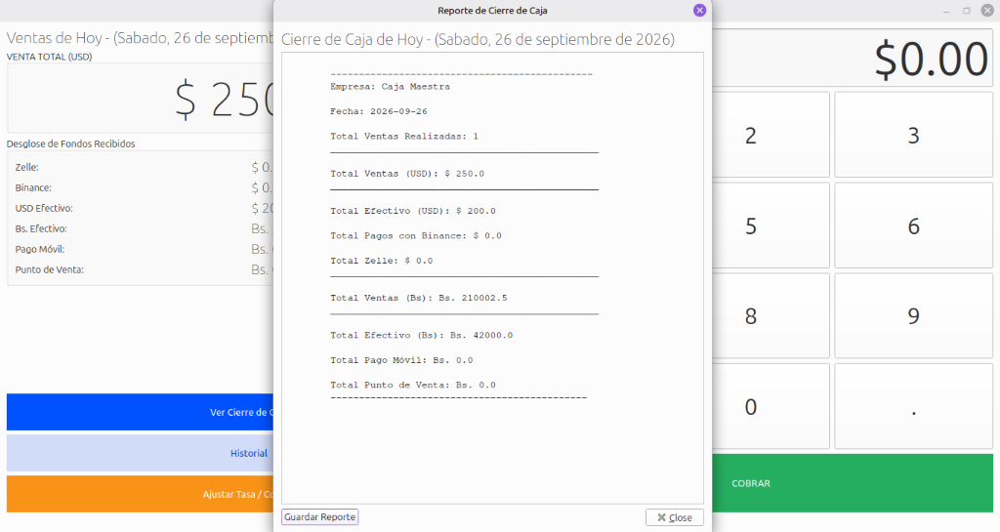

# CajaMaestra

CajaMaestra is a desktop Point of Sale (POS) and daily sales management application. It utilizes a standalone architecture where a local FastAPI backend and a PyQt6 graphical interface run simultaneously within the same process.

## Screenshots

### 1. Exchange Rate Configuration

*Initial setup of the daily exchange rate before processing sales.*

### 2. Main Dashboard

*Main POS interface for calculating and processing payments.*

### 3. Sales History

*Reviewing the history of processed sales for the current day.*

### 4. Daily Closing Report

*Generating the daily cash register closing report with payment method breakdowns.*

## Features

* Daily exchange rate management.
* Multi-currency payment processing (USD/BS Cash, Zelle, Binance Pay, Mobile Payment, Point of Sale).
* Real-time daily sales dashboard and reporting.
* Historical sales tracking.
* Self-contained SQLite database with automatic initialization.

## Tech Stack

* **Frontend:** PyQt6
* **Backend:** FastAPI, SQLAlchemy, Pydantic, SQLite
* **Server & Concurrency:** 
  * `uvicorn`: ASGI web server implementation used to run the FastAPI application.
  * `threading`: Used to run the Uvicorn server in a background daemon thread while the PyQt6 event loop runs in the main thread.
  * `multiprocessing`: Specifically `multiprocessing.freeze_support()`, utilized to prevent fork bombs and ensure the application runs safely when packaged into a standalone executable.
* **Packaging:** PyInstaller

## Installation and Execution

### Prerequisites
* Python 3.12 or higher.

### Running from source

1. Clone the repository and navigate to the project directory:
```bash
cd CajaMaestra
```

2. Create and activate a virtual environment:
```bash
python -m venv .venv
source .venv/bin/activate  # On Windows use: .venv\Scripts\activate
```

3. Install dependencies:
```bash
pip install -r requirements.txt
```

4. Run the application:
```bash
python main.py
```

### Packaging into a standalone executable

The repository includes a PyInstaller specification file (`CajaMaestra.spec`) pre-configured with all necessary hidden imports (such as Uvicorn loops and protocols) and UI file data.

To compile the application into a single executable, run:
```bash
pyinstaller CajaMaestra.spec
```

The resulting executable will be available in the `dist/CajaMaestra` directory.
